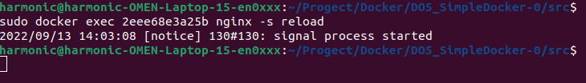

## Part 1. Готовый докер

> Рисунок 1.0. Устанавливаем docker.

> Рисунок 1.1. Берем официальный докер образ с nginx и выкачиваем его при помощи "docker pull".

> Рисунок 1.2. Проверяем наличие докер образа через "docker images" и запускаем с помощью "docker run".

> Рисунок 1.3. Проверяем, что образ запустился через "docker ps".

> Рисунок 1.4. Смотрим информацию о контейнере через "docker inspect". 

> Рисунок 1.5. Размер контейнера 

> Рисунок 1.6. Cписок замапленных портов: 80/tcp. 

> Рисунок 1.7. IP контейнера - 172.17.0.2. 

> Рисунок 1.8. Остановка докер-образа через "docker stop" и проверка, что образ остановился через "docker ps". 

> Рисунок 1.9. Запускаем докер с замапленными портами 80 и 443 на локальную машину через команду run. 

> Рисунок 2.0. Проверяем, что в браузере по адресу localhost:80 доступна стартовая страница nginx 

> Рисунок 2.1. Проверяем доступность стартовой страницы nginx с помощью команды "curl"

> Рисунок 2.2. Перезапускаем докер контейнер через "docker restart" и проверяем командой ps и в браузере, что есть процесс и nginx доступен. 

## Part 2. Операции с контейнером

> Рисунок 2.3. Чтение nginx.conf внутри докер контейнера с помощью команды "exec".

> Рисунок 2.4. Создаем на локальной машине файл nginx.conf и настраиваем в нем по пути /status отдачу страницы статуса сервера nginx.

> Рисунок 2.5. Скопируем созданный файл nginx.conf внутрь докер образа через команду docker cp.

> Рисунок 2.6. Перезапуск nginx внутри докер образа через команду exec.

> Рисунок 2.6. По адресу localhost:80/status отдается страничка со статусом сервера nginx.

> Рисунок 2.7. Экспортируем контейнер в файл container.tar через команду export.

> Рисунок 2.8. Остановим контейнер.

> Рисунок 2.9. Удалим образ через "docker rmi", не удаляя перед этим контейнеры.

> Рисунок 3.0. Удаляем остановленный контейнер.

> Рисунок 3.1. Импортируем докер образ из архива.

> Рисунок 3.2. Запускаем импортированный контейнер.

> Рисунок 3.3. Проверяем, что по адресу localhost:80/status отдается страничка со статусом сервера nginx